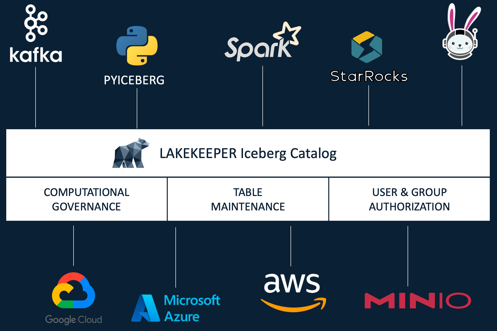

# Lakekeeper

Lakekeeper is a **secure**, **fast** and **easy to use** Apache Iceberg REST Catalog implementation written in Rust.
Start by reading [Getting Started](getting-started.md), then check [Documentation & Concepts](docs/nightly/concepts.md) for more details information.

## Features

- **Written in Rust**: Single all-in-one binary - no JVM or Python env required.
- **User Friendly**: We offer a UI, Helm-Charts, Binary executables for all major platform, a comprehensive documentation and much more. Let us know if you miss anything!
- **Storage Access Management**: Lakekeeper secures access to your data using [Vended-Credentials and remote signing for S3](docs/nightly/storage.md#s3). All major Hyperscalers (AWS, Azure, GCP) as well as on-premise deployments with S3 are supported.
- **Openid Provider Integration**: Use your own identity provider for authentication, just set `LAKEKEEPER__OPENID_PROVIDER_URI` and you are good to go.
- **Native Kubernetes Integration**: Use our helm chart to easily deploy high available setups and natively authenticate kubernetes service accounts with Lakekeeper. Kubernetes and OpenID authentication can be used simultaneously. A [Kubernetes Operator](https://github.com/lakekeeper/lakekeeper-operator) is currently in development.
- **Change Events**: Built-in support to emit change events (CloudEvents), which enables you to react to any change that happen to your tables.
- **Change Approval**: Changes can also be prohibited by external systems. This can be used to prohibit changes to tables that would invalidate Data Contracts, Quality SLOs etc. Simply integrate with your own change approval via our `ContractVerification` trait.
- **Multi-Tenant capable**: A single deployment of Lakekeeper can serve multiple projects - all with a single entrypoint. Each project itself supports multiple Warehouses to which compute engines can connect.
- **Customizable**: Lakekeeper is meant to be extended. We expose the Database implementation (`Catalog`), `SecretsStore`, `Authorizer`, Events (`CloudEventBackend`) and `ContractVerification` as interfaces (Traits). This allows you to tap into any access management system of your company or stream change events to any system you like - simply by implementing a handful methods.
- **Well-Tested**: Integration-tested with `spark`, `pyiceberg`, `trino` and `starrocks`.
- **High Available & Horizontally Scalable**: There is no local state - the catalog can be scaled horizontally easily.
- **Fine Grained Access (FGA):** Lakekeeper's default Authorization system leverages [OpenFGA](https://openfga.dev/). If your company already has a different system in place, you can integrate with it by implementing a handful of methods in the `Authorizer` trait.
- **Ecosystem First**: We are not bound to a vendor. We care about the whole ecosystem and not just a single query engine.

If you are missing something, we would love to hear about it in a [Github Issue](https://github.com/lakekeeper/lakekeeper/issues/new).
